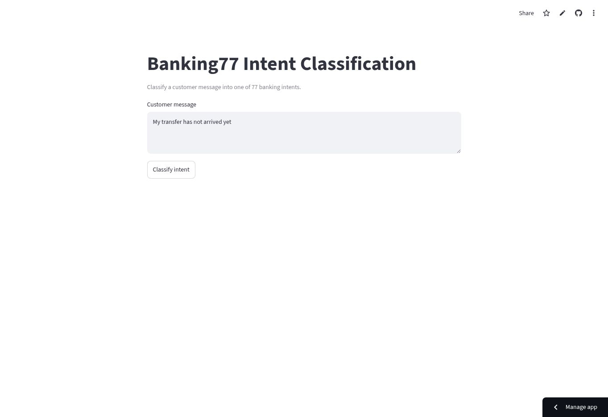

# Banking77 NLP Intent Classification

[](https://karim797-banking77-nlp.streamlit.app/)

End-to-end intent classification across 77 banking categories, comparing TF-IDF with Logistic Regression, SimpleRNN, Bidirectional LSTM, and fine-tuned DistilBERT.



## DistilBERT Results

- Held-out test accuracy: **0.9039**
- Held-out test macro F1: **0.9040**
- Validation macro F1: **0.8955**
- Fine-tuning configuration: DistilBERT, 4 epochs, max length 64, lower two Transformer layers frozen

The public Streamlit application uses the validated TF-IDF and Logistic Regression pipeline for fast, CPU-friendly inference with no API key.

## Technologies

Python, Pandas, NumPy, scikit-learn, TF-IDF, TensorFlow, SimpleRNN, BiLSTM, PyTorch, Hugging Face Transformers, DistilBERT, Streamlit, Jupyter.

## Project Structure

```text
.
├── app.py
├── nlp_project.ipynb
├── run_distilbert_cpu.py
├── artifacts/distilbert/metrics.json
├── assets/app-screenshot.jpg
├── requirements.txt
├── requirements-notebook.txt
├── LICENSE
└── README.md
```

## How to Run

```bash
git clone https://github.com/Karim797/Banking77-NLP-Intent-Classification.git
cd Banking77-NLP-Intent-Classification
python -m venv .venv
source .venv/bin/activate  # Windows: .venv\Scripts\activate
pip install -r requirements.txt
streamlit run app.py
```

For the full notebook and Transformer experiment:

```bash
pip install -r requirements-notebook.txt
jupyter notebook nlp_project.ipynb
```

No API key is required. The public Banking77 dataset is downloaded automatically.

## License

Released under the [MIT License](LICENSE).
