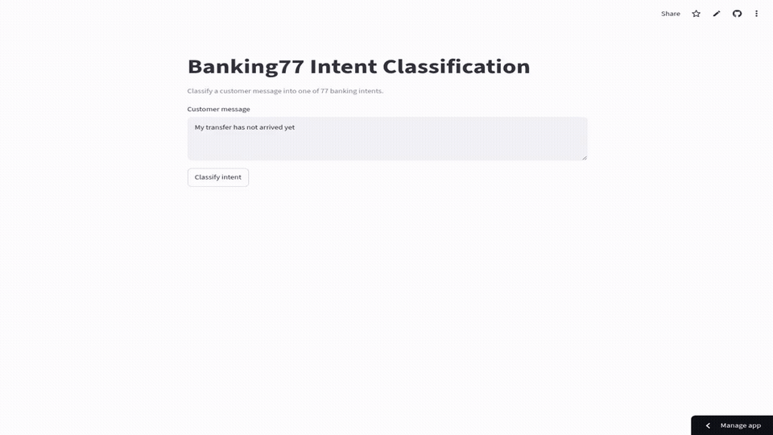

# Banking77 NLP Intent Classification

[](https://karim797-banking77-nlp.streamlit.app/)

End-to-end intent classification across 77 banking categories, comparing TF-IDF with Logistic Regression, SimpleRNN, Bidirectional LSTM, and fine-tuned DistilBERT.



[Download the HD MP4 demo](assets/app-demo.mp4)

## Validated Results

| Model | Official test macro F1 |
|---|---:|
| **TF-IDF (word + character n-grams) + Logistic Regression** | **0.9128** |
| DistilBERT, previous companion run¹ | 0.9040 |

- Official test accuracy: **0.9127**
- Train-only macro F1: **0.9097**
- Refit gain: **+0.0031 macro F1**
- Non-duplicated test macro F1: **0.9126**
- Exact train/test overlaps: **6 of 3,080 rows (0.195%)**
- Validation-selected confidence threshold: **0.45**
- Automatic-routing coverage on validation: **90.7%**
- Accuracy on routed validation traffic: **95.15%**

The Streamlit application loads the validated, full-pool-refitted artifact. Queries below the saved confidence threshold are escalated for human review instead of being routed speculatively.

¹The DistilBERT number is a real result from the committed companion run, but that run used an 80/20 training/validation split while the final TF-IDF experiment used 85/15. The comparison is therefore approximate rather than strictly like-for-like. DistilBERT is an optional benchmark experiment; it is not the model served by the application.

## MVP Status

- Production model: **TF-IDF word + character n-grams with Logistic Regression**
- Saved model, label mapping, confidence threshold, and provenance metadata included
- Streamlit inference runs directly from the committed artifact; no training or API key is required
- Low-confidence messages are escalated instead of being assigned a speculative intent
- DistilBERT is retained as a documented comparison and is not required to run the MVP

## Technologies

Python, Pandas, NumPy, scikit-learn, TF-IDF, TensorFlow, SimpleRNN, BiLSTM, PyTorch, Hugging Face Transformers, DistilBERT, Streamlit, Jupyter.

## Project Structure

```text
.
├── app.py
├── nlp_project.ipynb
├── run_distilbert_cpu.py
├── artifacts/final_model/tfidf_logreg_pipeline.joblib
├── artifacts/final_model/metadata.json
├── artifacts/final_model/label_mapping.json
├── artifacts/distilbert/metrics.json
├── assets/app-demo.gif
├── assets/app-demo.mp4
├── requirements.txt
├── requirements-notebook.txt
├── LICENSE
└── README.md
```

## How to Run

```bash
git clone https://github.com/Karim797/Banking77-NLP-Intent-Classification.git
cd Banking77-NLP-Intent-Classification
python -m venv .venv
source .venv/bin/activate  # Windows: .venv\Scripts\activate
pip install -r requirements.txt
streamlit run app.py
```

For the full notebook and Transformer experiment:

```bash
pip install -r requirements-notebook.txt
jupyter notebook nlp_project.ipynb
```

No API key is required. The deployed app loads the committed model artifact directly; it does not retrain on startup.

## License

Released under the [MIT License](LICENSE).
